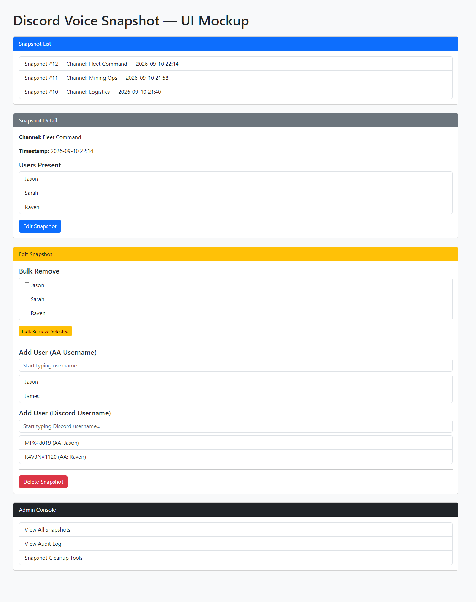

# aa-discordvoice-snapshots

This module records Discord voice channel activity and provides tools for
managing, auditing, and cleaning up snapshots. It integrates directly with
Alliance Auth and supports advanced editing features such as autocomplete,
Discord username lookup, and bulk user removal.

---

## Features

### Snapshot Management
- Create snapshots manually or via periodic Celery tasks
- View snapshot details and user lists with privacy-aware filtering
- Edit snapshots (add/remove users, tags)
- Bulk remove users
- Delete snapshots safely with confirmation
- Track creator metadata and retention policies

### Advanced Editing Tools
- AA username autocomplete
- Discord username lookup (editor-only)
- Bulk user removal via checkbox UI
- Snapshot privacy and retention controls for admins

### Admin Tools
- Snapshot cleanup (old snapshots, empty snapshots)
- Audit log viewer
- Retention policy configuration for snapshots and logs
- Admin console navigation entry

### API Endpoints
- Snapshot list with pagination and sorting
- User snapshot history
- Audit log
- Audit log trim endpoint
- Username autocomplete
- Discord username search (editor-only)

---

## Installation

### Github link
```
pip install git+https://github.com/frfrmpukin/aa-discordvoice-snapshots
```
### Edit local.py
Add to INSTALLED_APPS
```
INSTALLED_APPS += ["discordvoice_snapshots"]
```

Register the module URLs in your Alliance Auth project's root URL
configuration, normally `myauth/myauth/urls.py`:

```python
from django.urls import include, path

from allianceauth import urls

urlpatterns = [
    path("", include(urls)),
    path(
        "discordvoice-snapshots/",
        include(("discordvoice_snapshots.urls", "discordvoice_snapshots")),
    ),
]
```

The URL registration is required because installing a Python package cannot
modify the host Alliance Auth project's URL configuration automatically.
If the URL is not registered yet, the navigation hook will remain hidden rather
than interrupting the rest of the Alliance Auth menu.

Also activate periodic tasks
```
CELERYBEAT_SCHEDULE["snapshot_every_10min"] = {
    "task": "discordvoice_snapshots.tasks.periodic_snapshot",
    "schedule": 600,
}

CELERYBEAT_SCHEDULE["cleanup_daily"] = {
    "task": "discordvoice_snapshots.tasks.periodic_cleanup",
    "schedule": crontab(hour=3, minute=0),
}

CELERYBEAT_SCHEDULE["retention_daily"] = {
    "task": "discordvoice_snapshots.tasks.periodic_retention_cleanup",
    "schedule": crontab(hour=4, minute=0),
}
```
### Migrate to add database tables
```
python /home/allianceserver/myauth/manage.py migrate
```
### Collect Static Files
```
python /home/allianceserver/myauth/manage.py collectstatic --noinput
```
### Reboot the project
```
supervisorctl restart myauth:
```

---

## Permissions & Roles
This module uses Alliance Auth’s group‑based permission system (AA 5.x).
Access is controlled through the following recommended groups:

### Viewer
Can:
- `View snapshots`
- `View user snapshot history`
Requires Django permissions:
- `discordvoice_snapshots.view_snapshot`
- `discordvoice_snapshots.view_snapshotuser`

### Editor
Can:
- `Take snapshots`
- `Add/remove users from snapshots`
- `Bulk remove users`
- `Edit tags`
Requires Django permissions:
- `All Viewer permissions`
- `discordvoice_snapshots.add_snapshotuser`
- `discordvoice_snapshots.change_snapshotuser`
- `discordvoice_snapshots.delete_snapshotuser`
- `discordvoice_snapshots.change_snapshot`

### Admin
Can:
- `All Editor actions`
- `Delete snapshots`
- `View audit logs`
- `Manage retention and cleanup`
- `Access admin console`
Requires Django permissions:
- `All Editor permissions`
- `discordvoice_snapshots.add_snapshot`
- `discordvoice_snapshots.change_snapshot`
- `discordvoice_snapshots.delete_snapshot`
- `discordvoice_snapshots.view_auditlog`

### SuperAdmin
Alliance Auth superusers automatically bypass all permission checks.

### Privacy Model
- Standard users can view only their own membership in a snapshot unless they have editor or admin role permissions.
- Editors can review snapshots they are authorized to manage.
- Admins can access the full audit and retention tools.
- Retention windows can be configured independently for snapshots and audit logs.

### Automatic Group Setup
A management command is included:
```
python manage.py create_snapshot_groups
```
This command will:
- Detect existing AA groups (`Viewer`, `Editor`, `Admin`, `SuperAdmin`)
- Assign the correct permissions
- Create missing groups if needed (optional `--force-create`)
  
---

## Navigation Entry
The module adds a sidebar entry for users with the correct permissions.

---

## Support
### This module is custom-built for Alliance Auth environments requiring Discord
voice activity tracking and administrative tools.

✔ Professional  
✔ Complete  
✔ AA‑style  
✔ No placeholders  

---

## 🖼️ **Full UI Screenshot Mockup (HTML-only)**

This is a **static HTML mockup** showing what the UI looks like visually.  
You can open it in a browser via the docs folder to preview the layout.

[](docs/ui_mockup.html)
